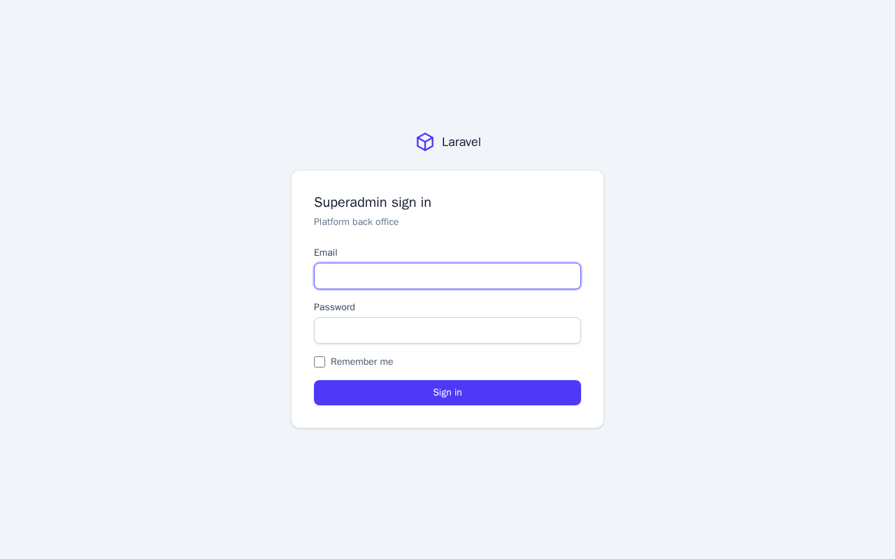
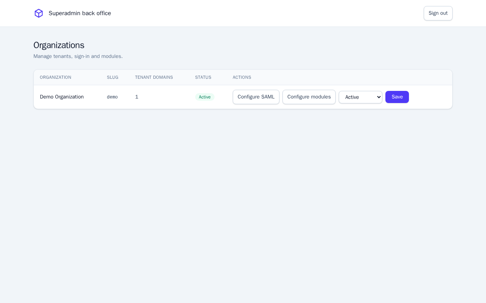
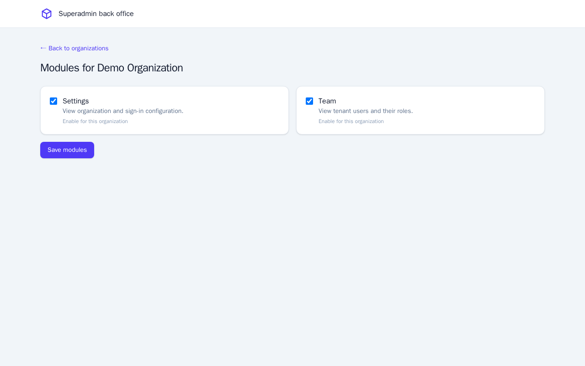
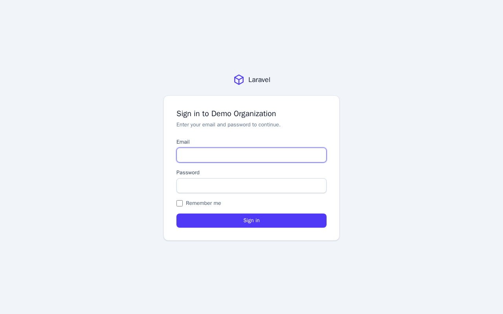
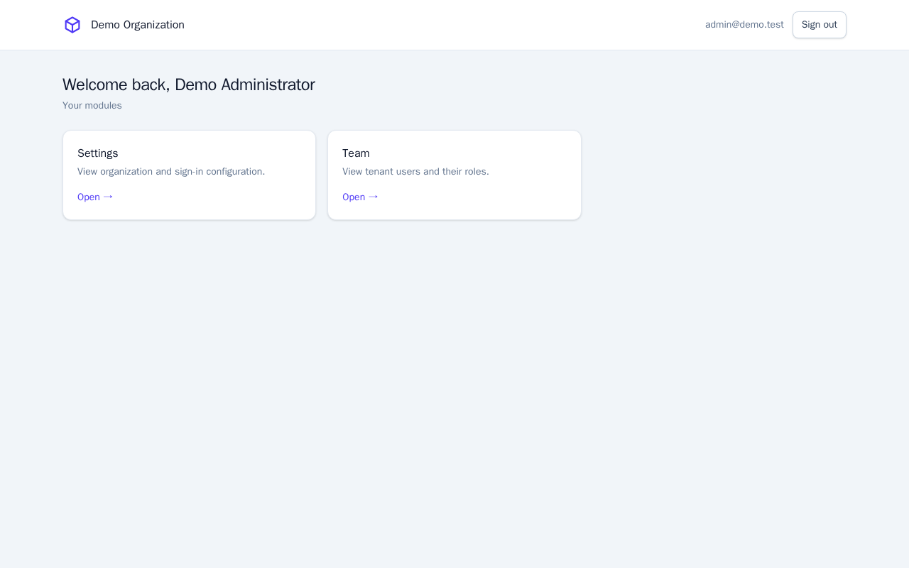
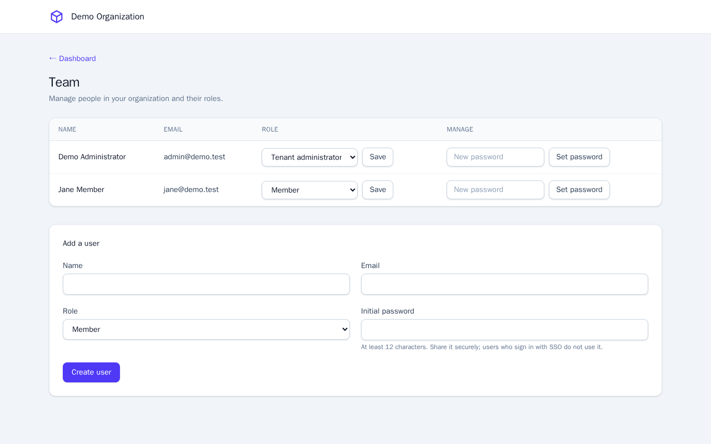
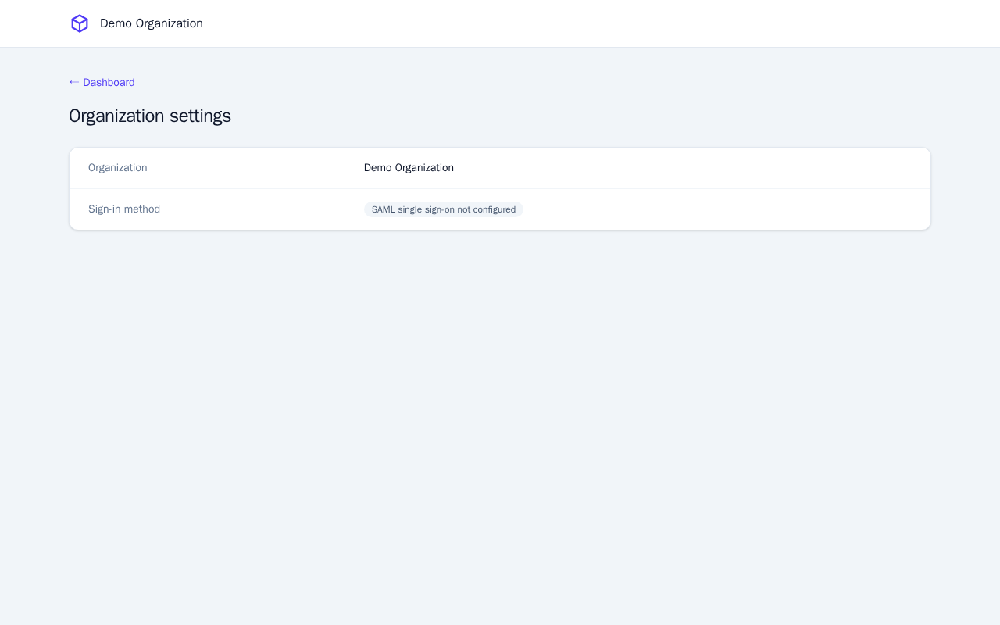
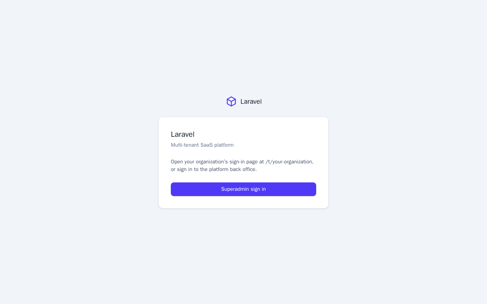

# Laravel SaaS Template

A multi-tenant SaaS starter built on **Laravel 12** and a ready-to-use
**GitHub Codespaces / devcontainer** environment. Every customer organization
gets its own database, its own sign-in method (SAML SSO or password), its own
users and roles, and only the modules the platform operator enables for it.

## Features

- **Database-per-organization multi-tenancy** with
  [stancl/tenancy](https://tenancyforlaravel.com). Tenant URLs are path based
  (`/t/{slug}`) by default; subdomain resolution is available through
  `TENANCY_RESOLUTION=subdomain`.
- **Superadmin back office** (`/admin`) with its own guard and accounts: list
  organizations, suspend or reactivate them, enable modules per organization,
  and configure SAML.
- **Per-organization SAML 2.0 SSO** using
  [onelogin/php-saml](https://github.com/SAML-Toolkits/php-saml). Responses and
  assertions must be signed, destinations are matched strictly, and requests are
  single use. Certificates are encrypted at rest.
- **Password sign-in fallback**: when an organization's SSO is disabled or not
  configured, its login page shows an email and password form (rate limited).
- **Tenant roles and user management**: *Tenant administrator* and *Member*
  roles. Administrators create users, change roles, and set passwords; the last
  administrator can never be demoted.
- **Module catalog**: the superadmin decides which modules (Team, Settings) each
  organization can use; the tenant dashboard lists only enabled ones.
- **Local identity provider**: a Keycloak container with a pre-configured SAML
  realm for developing and testing SSO.
- **Tailwind CSS 4 UI** with shared Blade layouts, plus mailpit, phpMyAdmin,
  Redis and MySQL in the devcontainer.
- **Cashier** (Stripe billing) is installed and ready to be wired up.

## Screenshots

### Superadmin back office

| Sign in | Organizations |
|---|---|
|  |  |



### Organization (tenant) area

| Sign in | Dashboard |
|---|---|
|  |  |



| Settings | Landing page |
|---|---|
|  |  |

## Getting started

Open the repository in **GitHub Codespaces** (or a local devcontainer). The
container installs dependencies, creates `.env`, and runs the central
migrations. Then:

```sh
php artisan db:seed                 # module catalog + demo organization
php artisan superadmin:create       # first platform administrator
npm run build                       # or `npm run dev` for Vite
php artisan serve --host=0.0.0.0    # http://localhost:8000
```

- **Back office:** `/admin/login`
- **Demo organization:** `/t/demo` (seeded tenant administrator
  `admin@demo.test`, password from `DEMO_ADMIN_PASSWORD`, default `password`;
  local development only)
- After pulling changes, run `php artisan migrate` and
  `php artisan tenants:migrate`, and rebuild assets with `npm run build`.

### Testing SSO with Keycloak

The devcontainer starts Keycloak on port `8081` with a `saas-dev` realm and a
demo user. Connect the demo organization with:

```sh
php artisan saml:import-metadata demo \
  http://keycloak:8080/realms/saas-dev/protocol/saml/descriptor --enable
```

See [Keycloak development](documentation/user/keycloak-development.md) for
credentials, Codespaces URLs, and resetting the realm. These credentials are for
local development only.

### Tests

```sh
php artisan test
```

## Documentation

| Topic | Location |
|---|---|
| Architecture and tenancy | [`documentation/technical`](documentation/technical) |
| Superadmin and tenant guides | [`documentation/user`](documentation/user) |
| Dated change logs and handoff notes | [`documentation/development`](documentation/development) |

Every change set must include a dated changelog in `documentation/development/`.

## Status and roadmap

- Keycloak SSO is configured in the repository but has not yet been verified end
  to end (it requires recreating the Keycloak volume).
- Not yet built: user invitations by email, password reset, billing flows, and
  additional modules.

## License

Released under the [MIT license](https://opensource.org/licenses/MIT). Built on
the [Laravel](https://laravel.com) framework.
